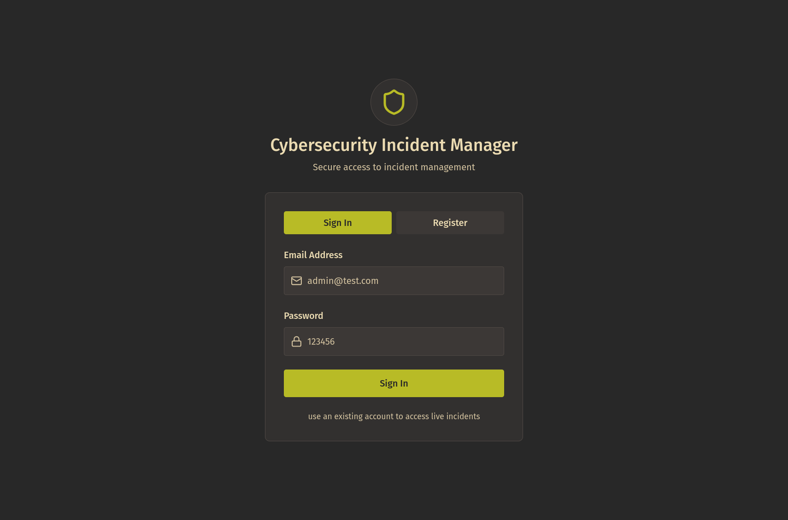
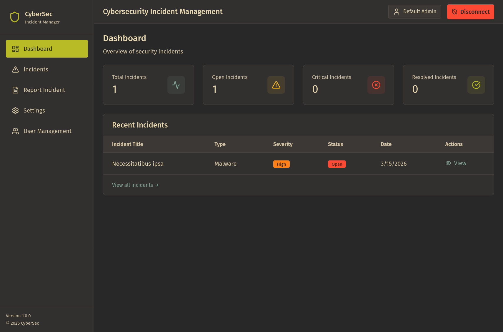

# Cybersecurity Incident Management UI 🛡️

A full-stack incident tracking platform for security teams, built with a modern React frontend and ASP.NET Core backend.

---

## Overview 🚀

This project helps teams report, track, and resolve cybersecurity incidents with role-based access:

- **Admin** 👑: full visibility, incident deletion, analyst management
- **Analyst** 🧠: can create incidents, update their own incidents, and is locked from editing once an incident is resolved

---

## Screenshots 📸





---

## Tech Stack 🧰

**Frontend** 🎨
- React + TypeScript
- Vite
- Tailwind CSS

**Backend** ⚙️
- ASP.NET Core (.NET 9)
- Entity Framework Core
- SQLite
- BCrypt password hashing

---

## Quick Start ⚡

### 1. Run Backend

```bash
cd backend
dotnet run
```

### 2. Run Frontend

```bash
cd frontend
npm install
npm run dev
```

Frontend runs on Vite dev server and proxies API requests to the backend.

---

## Default Admin Account 🔐

Seeded automatically at backend startup:

- **Email**: `admin@admin.com`
- **Password**: `admin123`

---

## Access Rules 📋

| Feature | Admin | Analyst |
|---|---|---|
| View incidents | Yes (all) | Yes (own only) |
| Create incidents | Yes | Yes |
| Update incident details | Yes | Yes (own only, not resolved) |
| Update incident status | Yes | Yes (own only, not resolved) |
| Delete incidents | Yes | No |
| View users | Yes (analysts only) | No |
| Delete users | Yes (analysts only) | No |

---

## Project Structure 🗂️

```text
.
├── backend/
│   ├── Controllers/
│   ├── Data/
│   ├── Models/
│   └── Services/
└── frontend/
	├── src/app/components/
	├── src/app/pages/
	├── src/app/context/
	└── src/app/lib/
```

---

## Notes 📝

- Passwords are stored as BCrypt hashes 🔒.
- API caller identity is passed with `X-User-Id` in frontend requests 📨.
- User management intentionally hides Admin accounts and manages analysts only 👥.
